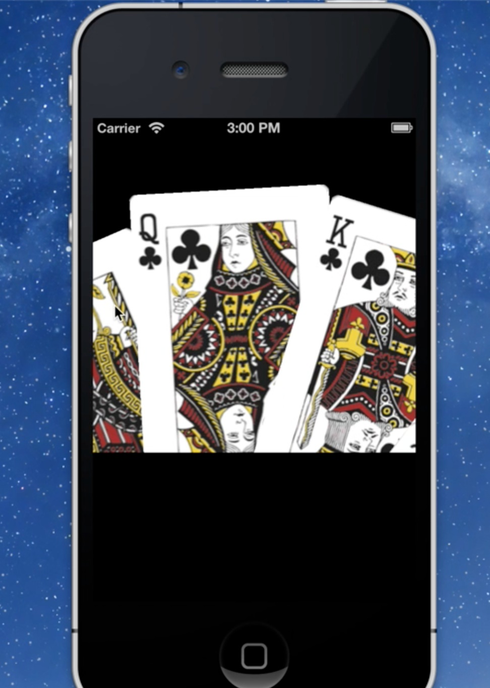

RouletteWheelCollectionViewDemo
===============================

Demo of a custom UICollectionViewFlowLayout subclass implementation of a roulette wheel of cards, in the style of the Yahoo TimeTraveler app.

For details please refer to:
http://corgitoergosum.net/?p=1296

License
---
MIT (https://github.com/kenshin03/RouletteWheelCollectionViewDemo/blob/master/LICENSE)


Screenshot
---



[Vimeo Video](https://vimeo.com/61983299 "Vimeo Video")


Usage
---
* Import `RVCollectionViewCell.h` and `RVCollectionViewLayout.h` in your class.
* Create a `UICollectionView` instance, and use `RVCollectionViewLayout.h` as the layout class.
* Implement the necessary `UICollectionViewDataSource` and `UICollectionViewDelegateFlowLayout` methods.
* Prepare your own data source. 


Example Code
---
DemoViewController.m:
```  objc
#import "RVCollectionViewCell.h"
#import "RVCollectionViewLayout.h"

@interface RVViewController ()<UICollectionViewDataSource, UICollectionViewDelegateFlowLayout>
...

/* inits the layout object and sets it to your uicollectionview via setCollectionViewLayout: */

    [self.collectionView registerClass:[RVCollectionViewCell class] forCellWithReuseIdentifier:@"ItemIdentifier"];
    
    self.collectionViewLayout = [[RVCollectionViewLayout alloc] init];
    self.collectionViewLayout.superView = self.view;
    [self.collectionView setCollectionViewLayout:self.collectionViewLayout];

...

/* In cellForItemAtIndexPath:, return an instance of RVCollectionViewCell */

-(UICollectionViewCell *)collectionView:(UICollectionView *)collectionView cellForItemAtIndexPath:(NSIndexPath *)indexPath
{
    RVCollectionViewCell *cell = (RVCollectionViewCell *)[collectionView dequeueReusableCellWithReuseIdentifier:@"ItemIdentifier" forIndexPath:indexPath];
    cell.imageView = self.imagesArray[indexPath.item];
    return cell;
}

```

Attribution
---
The card images are works of yozzo from DeviantArts - http://yozzo.deviantart.com/
